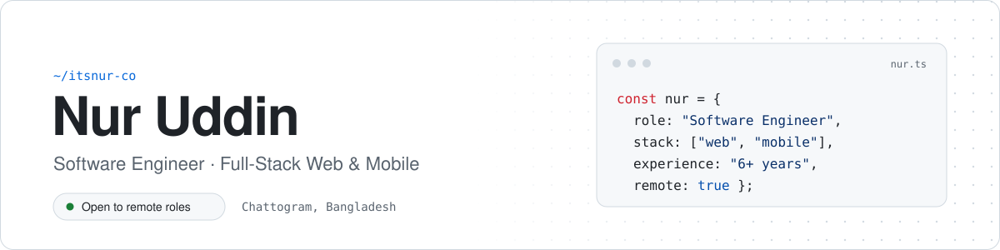

<a href="https://nur.storlox.com">
  <picture>
    <source media="(prefers-color-scheme: dark)" srcset="./assets/banner-dark.svg">
    
  </picture>
</a>

  
  
  
  

 

### About

Full-stack software engineer with **6+ years** of building scalable web and mobile applications. I care about performance you can measure, architecture that stays clean, and code that is easy for the next developer to pick up.

My work spans **Shopware** eCommerce, **Next.js** and **React** frontends, **React Native** apps for iOS and Android, and the **Node.js** APIs behind them. I've also mentored junior developers along the way.

 

### Impact

<table>
  <tr>
    <td align="center" width="25%"><h3>−25%</h3>Application latency</td>
    <td align="center" width="25%"><h3>−30%</h3>Frontend load time</td>
    <td align="center" width="25%"><h3>+40%</h3>User engagement</td>
    <td align="center" width="25%"><h3>7</h3>Junior devs mentored</td>
  </tr>
</table>

 

### Experience

| Role | Company | Period |
| :--- | :--- | ---: |
| **Frontend Developer**  Enterprise eCommerce on Shopware · scalable UI in React & Next.js · system dashboards | Horizon Plus  Pristina, Kosovo | Oct 2025 – Aug 2026 |
| **Frontend Engineer**  Web & native apps with Next.js and React Native · 25% lower latency · 30% faster loads | Niibu Inc.  California, USA · Remote | Aug 2024 – Sep 2025 |
| **Frontend Developer**  Led Next.js, Redux & TypeScript apps · 40% more engagement · mentored 7 developers | Banao Technologies  Bangalore, India · Remote | Aug 2023 – Sep 2024 |
| **Full-Stack Developer** (Intern)  Active Directory auth & access control · Git workflows · cross-functional delivery | Across The Globe  Bangalore, India · Remote | Apr 2023 – Aug 2024 |

 

### Tech Stack

<table>
  <tr>
    <td width="120"><b>Frontend</b></td>
    <td>
      
      
      
      
      
      
      
      
      
    </td>
  </tr>
  <tr>
    <td><b>eCommerce</b></td>
    <td>
      
      
      
      
      
    </td>
  </tr>
  <tr>
    <td><b>Mobile</b></td>
    <td>
      
      
      
      
      
    </td>
  </tr>
  <tr>
    <td><b>Backend</b></td>
    <td>
      
      
      
      
      
      
      
      
      
    </td>
  </tr>
  <tr>
    <td><b>Tools & DevOps</b></td>
    <td>
      
      
      
      
      
      
      
      
    </td>
  </tr>
</table>

 

### Education

- **BBA (Hons.), Accounting** — National University, Dhaka · 2022 – 2025
- **Apollo Full-Stack Level 1** — Programming Hero · Nov 2023 – Dec 2024
- **Full-Stack Web Development** — Programming Hero · Dec 2022 – Apr 2023

 

---

  
    Open to remote roles and interesting collaborations ·
    <a href="mailto:itsnur.dev@gmail.com">itsnur.dev@gmail.com</a> ·
    <a href="https://www.buymeacoffee.com/itznur07">Buy me a coffee</a>
  

